============
対話型数値計算
============

目的
======

本章の目的は、
Pythonの対話型実行環境であるJupyter-notebookを用いてコンピュータによる数値計算を体感し、プログラミングの原理を実感することである。

Jupyter-notebookは、データ解析を簡単に実施できること、その結果を再利用かつ配布しやすい形で残すことができるため、現在急激に利用が広まっているソフトウェアである。

インストールも簡単であるため、各自のPCにもインストールすることを勧める。インストール方法の詳細については、補足を参照すること。

Jupyter-notebookの起動
=========================

Jupyterを起動するためにコマンドプロンプトを実行する。

いくつか方法があるが「Winキー」＋「R」を同時押しして「ファイル名から起動」を実行し、 ``cmd``
を入力しEnterを押す方法が簡単である。

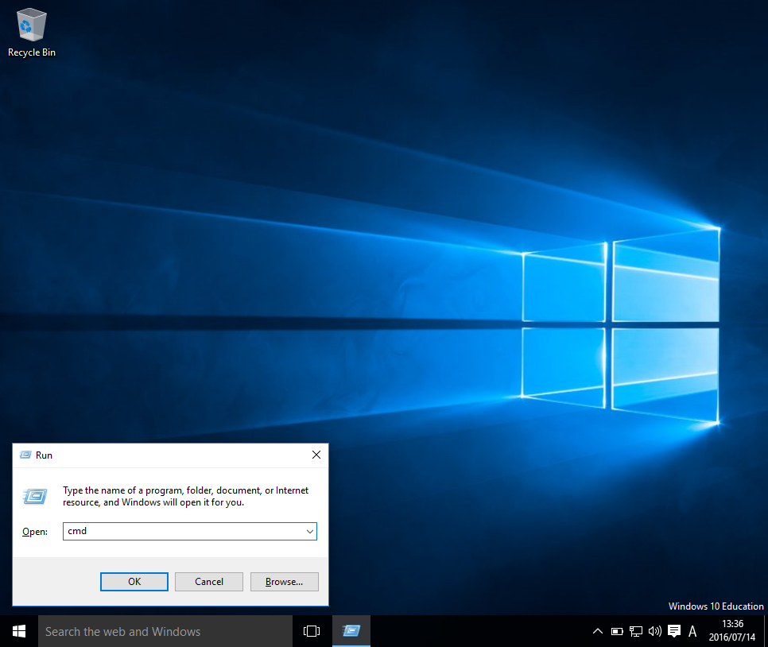

起動させたコマンドプロンプトで
``jupyter-notebook``
を入力し実行するとJupyter-notebookのスタート画面が立ち上がる。

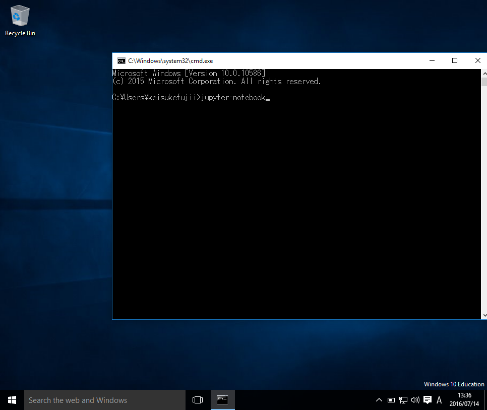

コマンドプロンプト内で「Jupyter-notebook」と入力し実行する。

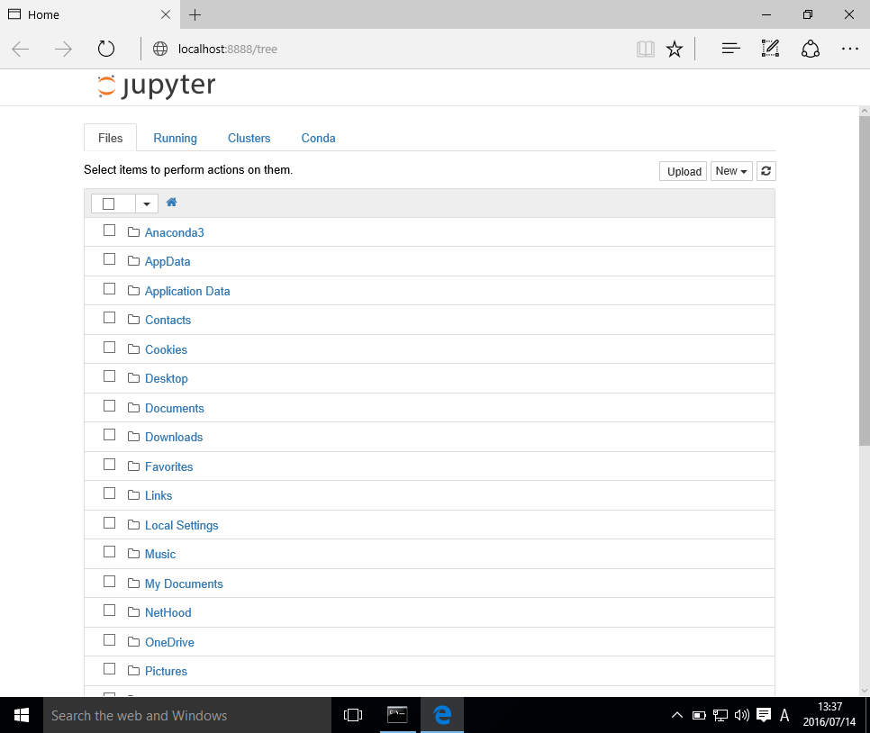

Jupyter-notebookの起動画面の一例。

Jupyer-notebookファイルの作成
==============================

本演習を含め、将来的にはJupyter-notebookファイルを大量に作成することになる。
作成したファイルを見つけやすくするために、フォルダ構造を整理する。

まず、マイドキュメント内に新しいフォルダを作成する。
右上の`new`メニューの中の ``Folder`` をクリックすると、Untitled Folderという名前のフォルダが作成される。

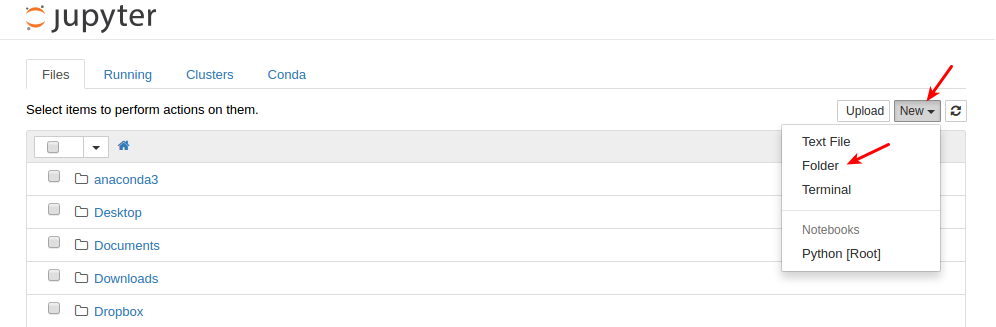

このままでは、このフォルダに何が入っているかわからないので、適切な名前に変更する。
フォルダ名を変更するには、フォルダ名の左側のチェックボックスにチェックを入れ、``Rename`` をクリックする。
これからこの授業で作成するファイルは、このフォルダ内に保存することにする。
ファイル名を ``Johokiso-enshu`` としよう。

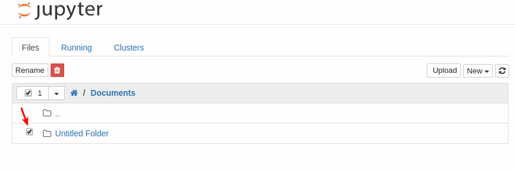

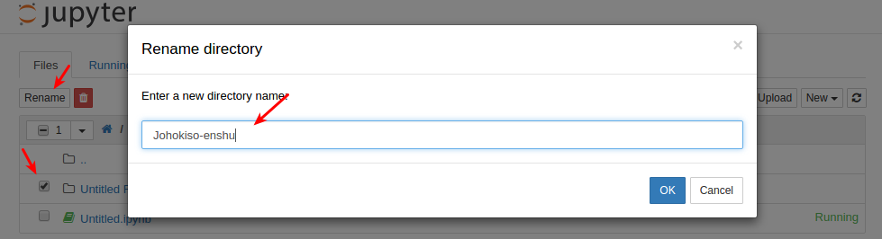

次に、このフォルダ内にJupyter-notebookファイルを作成する。
フォルダ名をクリックして ``Johokiso-enshu`` フォルダ内に移動する。

``New`` ボタンから ``Python [root]`` を起動する。

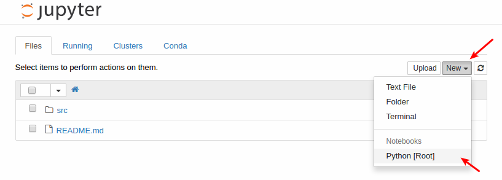

Jupyter-notebookの基本的な使用方法
=================================

ノートブック名の変更
-------------------

新しいノートブックファイルには名前がまだつけられていないので、名前を変更する。
Jupyerロゴの横のUntitledをクリックすることで名を変更できる。
今日はプログラミング1回目なので Programming1-start とする。

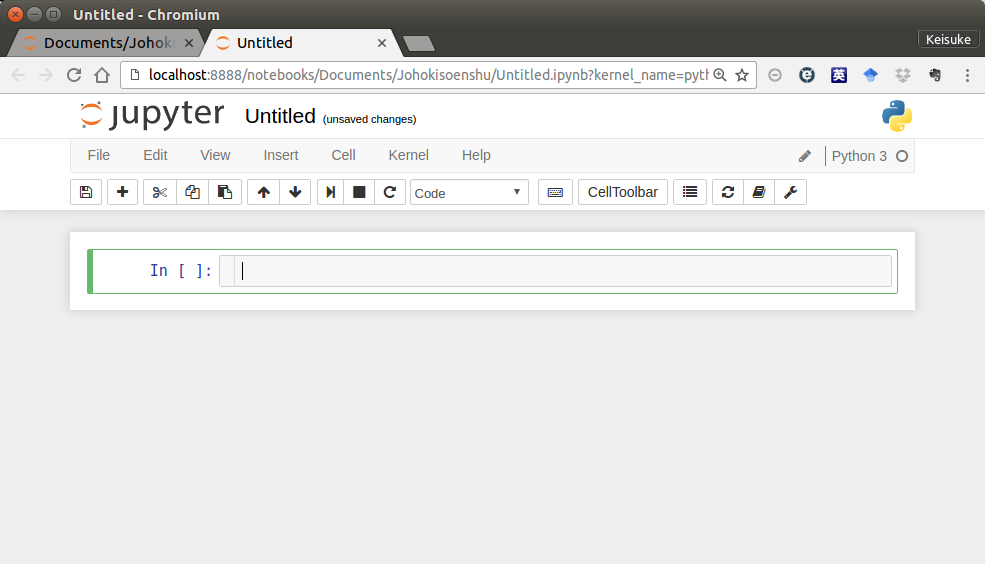

Jupyter-notebookで新しいPythonノートブックファイルを作成したときの様子。

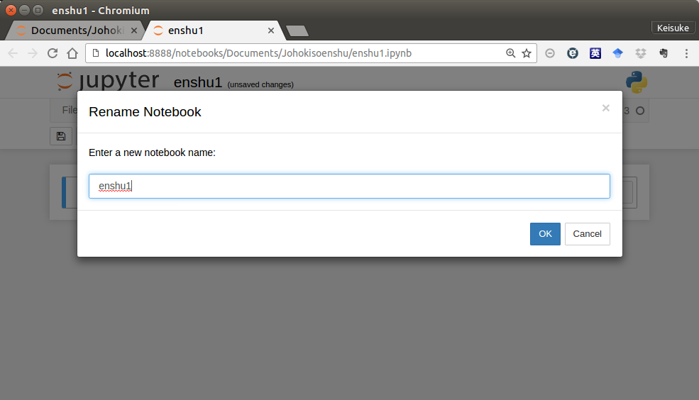

Jupyter-notebookファイルの名前を変更する。

Jupyter-notebookでの対話的プログラミング
----------------------------------------

習うより慣れろということで、まずは命令（スクリプト）を実行させてみよう。
以下にあるように、 :

  print('Hello world')

とセル内入力し、Shift + Enterの同時押しをするか、ツールバーの実行ボタンを押す。

エラーなく実行される場合、``Hello world`` とセルの下に表示されるはずである。

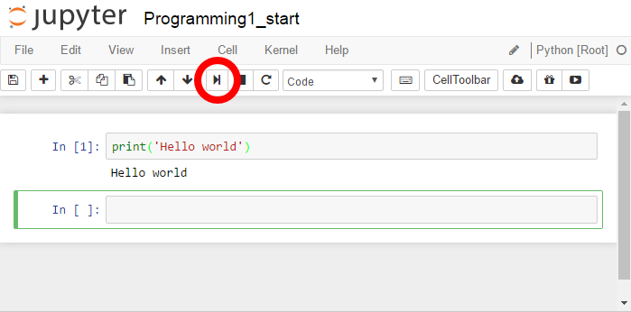

エラーがある場合は、以下のように、セルの下にエラーメッセージが表示される。
このような場合は、再度正しいスクリプトを入力し、実行する。

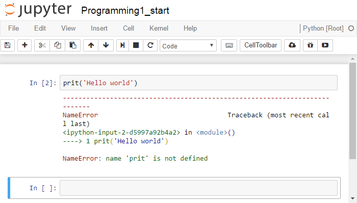

コマンドを誤って入力した例。

この ``print()`` 文は、カッコ内のものを画面に表示せよ、という命令である。
正しく入力できた時は、その結果が表示されていることがわかる。

次に、以下のように一連の命令を実行してみよう。

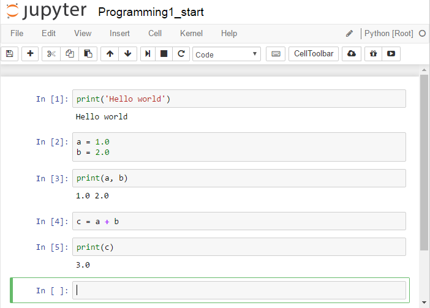

命令の内容は後で学ぶ。
今は、コンピュータに命令をし、その命令が正しければコンピュータがそれを実行することがわかれば十分である。

セルタイプ〜Code,Markdown〜
----------------------------

Jupyter-notebookのセルには、Code, Markdown、Raw NBConvertの3状態がある。
これは、画面上部メニューの ``Cell`` > ``Cell Type`` から設定できる。

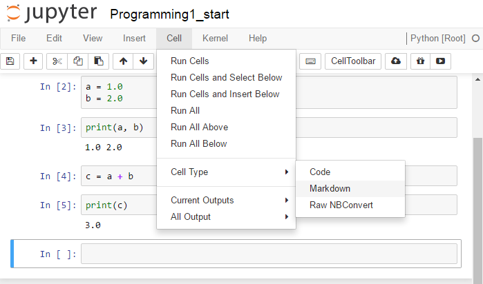

+ Code状態は、上記のようなコンピュータへの命令を記入するためのもの、
+ Markdown状態は、命令以外の文章、特にコードの説明を記入するものである。

Code状態はコンピュータへの命令内容を記述するためにもちろん重要であるが、
Markdown状態も、後でノートブックの内容を理解するために重要である。

Markdownセルを作成し、以下と同じ内容を記入して実行してみよ。

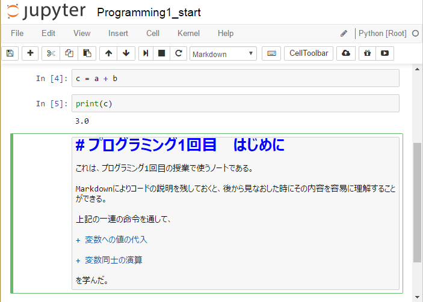

Markdownセルに入力している様子。

Jupyter-notebookファイルの保存
----------------------------

Jupyter-notebookファイルを保存するためには、左上の``File -> Save and Checkpoint``を選ぶか、
単純に左側のフロッピーディスクボタンをクリックする。

Jupyter-notebookの終了
-----------------------

上で作成したJupyter-notebookを保存し、ブラウザを閉じよ。
しかし実は、ブラウザを閉じただけでは実はソフトウェアは終了していない。
特に、ファイル一覧の画面で色がついたノートブックファイルは現在実行中のものを示している。

Jupyter-notebookを完全に終了させるためには、コマンドプロンプドに戻り、Ctrl+Cを押す必要がある。
