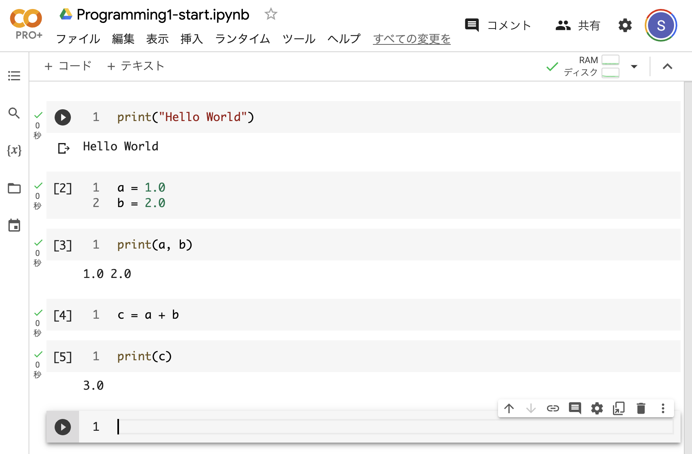

=================
対話型数値計算
=================

目的
======

本章の目的は、Pythonの対話型実行環境を用いてコンピュータによる数値計算を体感し、プログラミングの原理を実感することである。
なお本教科書は、Webページとしても公開している。

python_textbook: http://python-textbook.readthedocs.io

小さな画面で見る場合はWebページの方が適しているだろう。

Google Colaboratory（通称Colab）では、ブラウザ上でPythonを記述、実行できる。
以降ではColabの利用を想定して説明を行う。

Colab: https://colab.research.google.com

2023年3月現在、Google アカウントを持っていれば誰でも無料で利用可能である。
かんたんに利用を開始できる、自身のPCに新たにソフトウェアをインストールする必要がないためOS間でのリソースの再利用かつ配布がしやすい、といった利点がある。

ただし、上述の環境はインターネットに接続できないときには使えない。

Jupyter-notebookは、自身のPC上で起動できる対話型実行環境である。
データ解析を簡単に実施できること、その結果を再利用かつ配布しやすい形で残すことができるため、広く利用されているソフトウェアである。
インストールも簡単であるため、各自のPCにもインストールしておくと良い。
インストール方法を含むJupyter-notebookの詳細は、補足を参照すること。

Colabの起動
=========================

Colabのページから起動する
-----------------------------------------
Google Colabのリンク（https://colab.research.google.com）を開くと以下のようなページが表示される。

このページにはColabの簡単な説明が記載されているので目を通しておくと良い。

自身で新しいファイルを作成するには、ファイル＞ノートブックを新規作成をクリックする。

ノートブックを新規作成する画面の一例。

Colabの新規ノートブックの起動画面の一例。

この方法で作成したノートブックは自身のGoogle DriveのColab Notebooksというフォルダの中に保存される。

Google Driveから起動する
-----------------------------------------
Google Driveから起動すると、作成時にノートブックの場所を決めることができる。

Google Drive: https://www.google.com/drive/

Google Driveの画面で、ノートブックを保存したい場所を開き、新規＞その他＞Google Colaboratoryをクリックすると、その場所に新しいノートブックを作成できる。

Google Colaboratoryが見当たらない場合、代わりに、アプリの追加＞画面上部の虫眼鏡アイコンをクリック＞colabと入力後、エンター、とすることで、Colaboratoryを見つけられる。
検索結果のColaboratoryをクリックし、インストールをすれば使えるようになる。

Google DriveからColabを起動する画面の一例。情報基礎演習というフォルダの中にノートブックを作成するところ。

Colabを検索した結果。Colabを未インストールの場合、左側のColaboratoryをクリックし、インストールする。

Colab ノートブックの基本的な使用方法
=================================================

ノートブック名の変更
--------------------------

新しいノートブックファイルには名前がまだつけられていないので、名前を変更する。
画面右上のColabロゴの横のUntitled0.ipynbをクリックすることで名前を変更できる。
今日はプログラミング1回目なので Programming1-start.ipynb とする。

（拡張子.ipynbは、Colab上で用いる分には無くても問題ない。
Google Driveに保存したファイルをローカルのJupyter notebookでも使いたい場合、つけておくとよい。）

新しいノートブックファイルの名前を変更する。

ノートブックの保存
--------------------------
ノートブックを保存しないと、変更点が消去されてしまうため、変更を加えるごとにファイルの保存をすることをお勧めする。
ノートブックの保存はファイル＞保存をクリックして行う。

ノートブックを保存する。

上の画像にも記載があるが、ショートカット（Windowsではctrl+s、Macではcommand+s）を用いて保存することもできる。
保存が完了すると、画面左下に「保存しました」と表示される。

Colab ノートブックでの対話的プログラミング
---------------------------------------------

習うより慣れろということで、まずは命令（スクリプト）を実行させてみよう。
以下にあるように、

.. code-block:: python

   print('Hello world')

とセルに入力し、Shift + Enterの同時押しをするか、セルの左側の実行ボタンを押す。

エラーなく実行されれば、セルの下に ``Hello world`` と表示される。

コマンドを実行した結果と画面の説明。

エラーがある場合は、以下のように、セルの下にエラーメッセージが表示される。
このような場合は、再度正しいスクリプトを入力し、実行する。

コマンドを誤って入力した例。

この ``print()`` 文は、カッコ内のものを画面に表示せよ、という命令である。
正しく入力できた時は、その結果が表示されていることがわかる。

次に、以下のように一連の命令を実行してみよう。

命令の内容は後で学ぶ。
今は、コンピュータに命令をし、その命令が正しければコンピュータがそれを実行することがわかれば十分である。

セルタイプ
----------------------------

Colabのセルには、コードとテキストの2種類がある。
画面上部の`+ コード`、`+ テキスト`のボタンか、セルの下部に表示されるボタンをクリックすることで、それぞれの種類に応じたセルを追加することができる。

+ コードセルは、上記のようなコンピュータへの命令を記入するためのもの、
+ テキストセルは、命令以外の文章、特にコードの説明を記入するものである。

コードセルはコンピュータへの命令内容を記述するためにもちろん重要であるが、
テキストセルも、後でノートブックの内容を理解するために重要である。

テキストセルを作成し、以下と同じ内容を記入して実行してみよ。

.. image:: figs/fig_colab_start/text_cell.png
   :width: 80%
   :alt: text cell
   :align: center

テキストセルに入力している様子。左側が入力する部分で、右側にプレビューが表示されている。

Colabの終了
-----------------------

上で作成したノートブックを保存し、ブラウザを閉じてColabを終了せよ。
