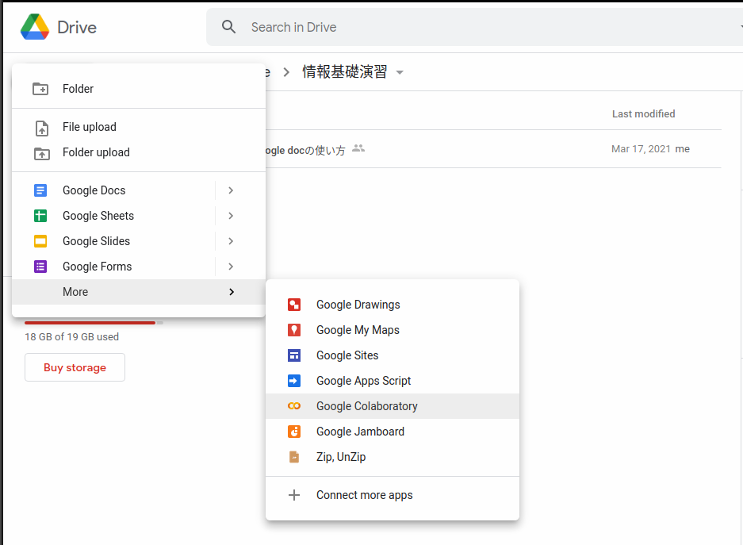
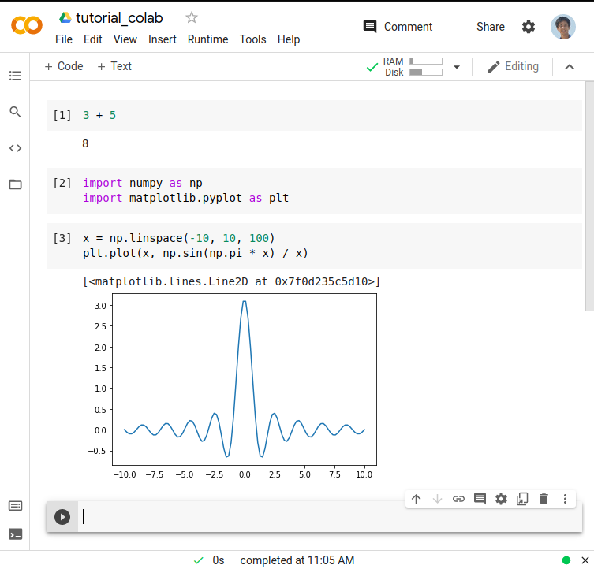

Google Colaboratory を用いたクラウド開発環境（補足）
==============================================================================

これまで、Google driveを用いることで、ローカルで作成した文書やスプレッドシートを簡単に共有できることを述べた。
クラウドを用いると、Microsoft Word や Excel を持っていない人でも、文書を閲覧・編集できるので非常に便利である。

同様に Google が提供しているGoogle Colaboratoryというサービスを用いることで、Pythonでのプログラム開発もクラウド上で行うことができる。
このようなサービスを用いると、Pythonの開発環境がローカルにない人でもすぐに開発されたスクリプトを閲覧したり、編集したりすることができる。

ただし、以下のようなデメリットもある。:

- 計算は常にGoogleの保有するサーバ上で行われるため、計算結果を確認できるまでタイムラグがある
- 起動し続ける時間に制限がある（24時間）
- ローカルにあるファイルの入出力が煩雑になる

Google Colaboratory を起動する
--------------------------------------------------------------------------------

以下のように、Google driveの任意のフォルダにGoogle Colaboratory ファイルを作成する。  
New > More > Google Colaboratory
とたどっていくと見つかる。

実際に Google Colaboratory を起動すると以下のような画面となる。
使い方の詳細は省略するが、ほとんどJupyter notebookと同様にして使うことができる。

