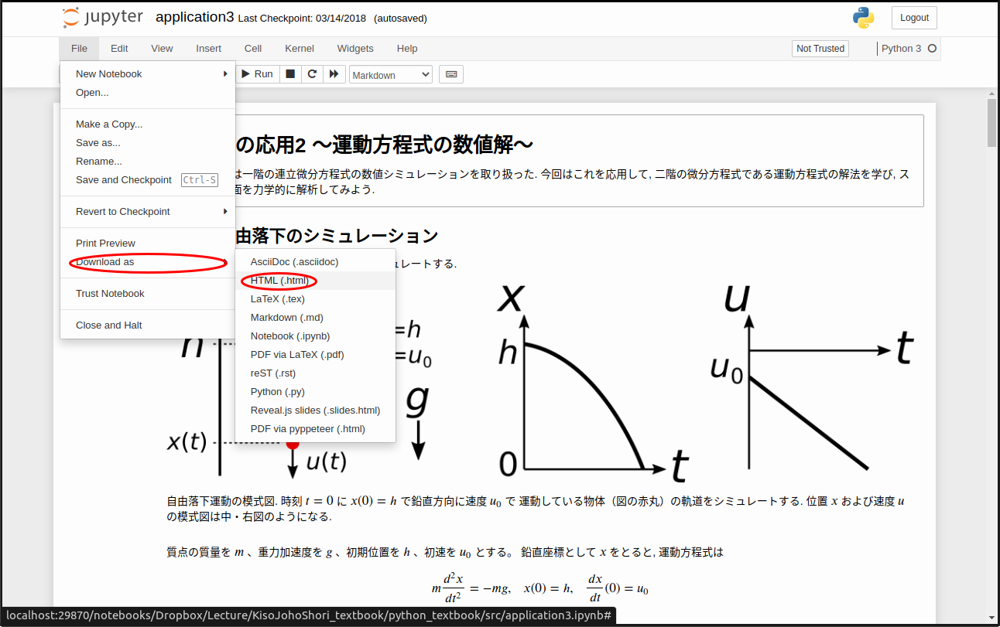
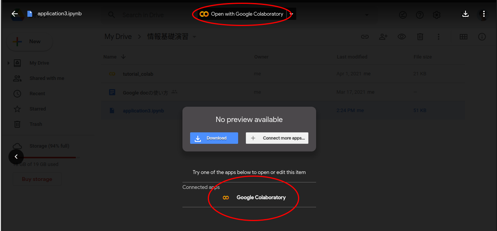

課題の提出方法
=============================================

本演習では、毎週課題を提出してもらう必要がある。
プログラミング演習の時間の課題は、特に指示がない限り以下のようにして提出すること。

まず、課題をJupyter-notebook内に実装・記述する。その後、:
1. このファイルをhtmlファイルに変換したものを添付ファイルとして、
2. このファイルを各自のGoogle driveにアップロードして、その共有リンクを本文に貼り付けて

PandAの課題提出ページから提出すること。1., 2. の片方ではなく、必ず両方の形式で課題を提出すること。
それぞれの方法の詳細を以下に述べる。

Jupyter-notebookをhtmlファイルとしてエクスポートする
-----------------------------------------------------------------------------------------

上図のように、File > Download as > HTML(.html) を選択する。
そうすると、任意の場所に .html ファイルを作成できる。

このようにして作成した .html ファイル をPandAの課題提出画面から添付ファイルとして添付せよ。
（なおこの方法では、採点者はプログラムがバグ無く実行できるか確かめることができない。そのため、次節の形式も合わせて提出すること）

Jupyter-notebookをGoogle driveにアップロードする
-----------------------------------------------------------------------------------------

Jupyter-notebook は、デフォルトでは C:\Users\<ユーザー名> で実行されている。
Jupyter-notebook内で作成されたファイルは、このディレクトリ内に見つけることができるであろう。

例えば、Jupyter-notebook でフォルダ johokiso を作成し、その中に week1.ipynb というファイルを作ったなら、そのファイルは実際には

C:\Users\<ユーザー名>/johokiso/week1.ipynb

として保存されているはずである。

このようにして見つけたファイルを、各自のGoogle driveにアップロードせよ。その共有リンクをPandAの課題提出画面から本文に貼り付けて提出せよ。

（補足）Jupyter-notebookをGoogle driveから開く
-----------------------------------------------------------------------------------------

Google は Google Colaboratoryというサービスを提供しており、Google drive上のJupyter-notebookファイルを閲覧・実行することができる。
Google drive上にアップロードしたJupyter-notebookファイルをクリックすると、以下のような画面が表示される。

ここで、画面の上または下に表示されている Google Colaboratory のロゴをクリックすることで、アップロードしたJupyter-notebookファイルを Google Colaboratory 上で開くことができる。