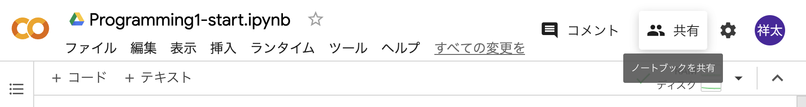
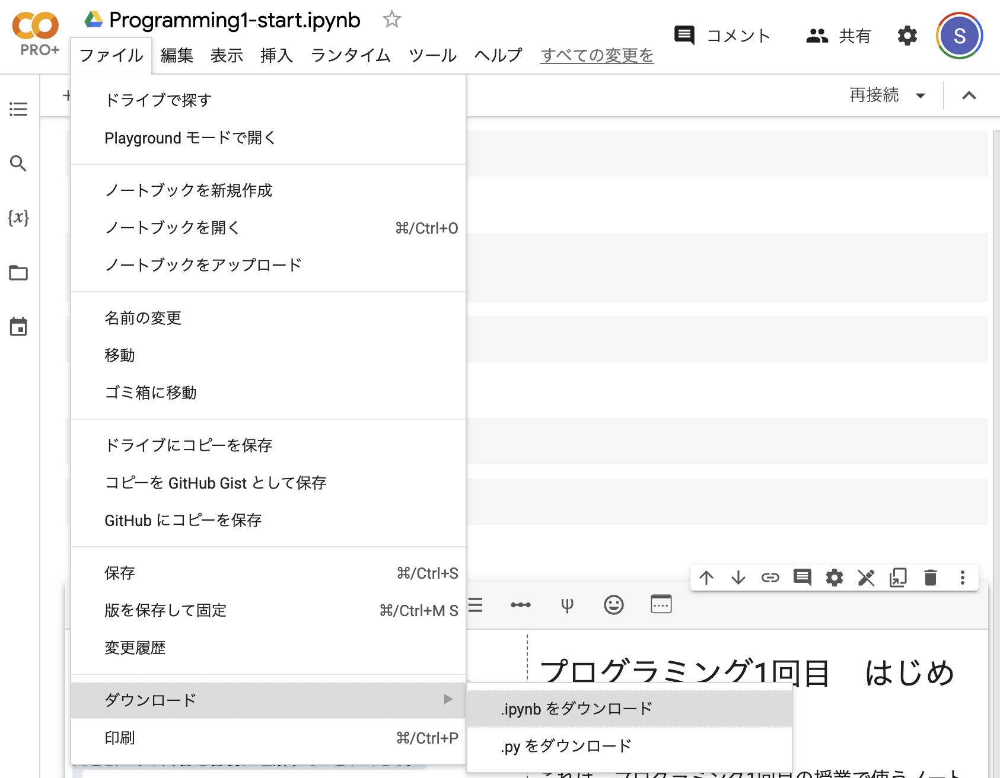

課題の提出方法
=============================================

本演習では、毎週課題を提出してもらう必要がある。
プログラミング演習の時間の課題は、特に指示がない限り以下のようにして提出すること。

まず、課題をColabのノートブックに実装・記述する。その後、

1. ノートブックの共有リンクを本文に貼り付けて、
2. ノートブックをhtmlファイルに変換したものを添付ファイルとして、

PandAの課題提出ページから提出すること。
1., 2. の片方ではなく、必ず両方の形式で課題を提出すること。

それぞれの方法の詳細を以下に述べる。

1. ノートブックの共有リンクをコピーする
-----------------------------------------------------------------------------------------
Colab ノートブック右上部の共有ボタンを押すと、共有リンクを生成するためのページが表示される。
一般的なアクセスのすぐ下の「制限付き」をクリックし、「リンクを知っている全員」に変更する。
その後、「リンクをコピー」をクリックすることで共有リンクをコピーできる。
コピーしたリンクをPandAの課題提出画面から本文に貼り付けて提出せよ。

ノートブック右上部に共有ボタンがある。

共有ボタンをクリックして出てくる画面。「制限付き」の部分を「リンクを知っている全員」に変更し、リンクを用いてアクセスできる人を変更する。

アクセス権を変更したあとの画面。「リンクをコピー」をクリックして共有用リンクをコピーする。

2. ノートブックをhtmlファイルに変換する
-----------------------------------------------------------------------------------------
手順

1. ノートブックをipynbファイルとしてダウンロードする。
2. ダウンロードしたipynbファイルをアップロードする。
3. いずれかのセルで以下のスクリプトを実行し、htmlファイルを作成する。

.. code-block:: python

   %%shell
   jupyter nbconvert --to html [path_of_ipynb_file]

4. 作成したhtmlファイルをダウンロードする。

以下に詳細を示す。

1. ノートブックをipynbファイルとしてダウンロードする。

ファイル＞ダウンロード＞ipynbをダウンロードをクリックし、ipynbファイルをダウンロードする。
このとき、ダウンロードした場所を覚えておく。

ipynbファイルをダウンロードする。

ダウンロードする場所を指定する。

2. ダウンロードしたipynbファイルをアップロードする。

ノートブック画面の左部のファイルアイコンをクリックすると、左側にファイルの一覧が表示される。
上部にあるアップロードアイコン（矢印が含まれるアイコン）をクリックし、先程ダウンロードしたipynbファイルを選択し、開く。

ファイルアイコンをクリックする。

ファイルアイコンをクリック後、アップロードアイコンをクリックする。

3. いずれかのセルで以下のスクリプトを実行し、htmlファイルを作成する。

アップロードしたhtmlファイルを右クリックし、パスをコピーする。

アップロードしたhtmlファイルのパスをコピーする。htmlファイルが表示されていない場合、アップロードアイコンの隣の更新アイコンをクリックする。

いずれかのセルに以下のスクリプトを入力し、実行する。
``[path_of_ipynb_file]`` の部分にはコピーしたパスを貼り付ける。

.. code-block:: python

   %%shell
   jupyter nbconvert --to html [path_of_ipynb_file]

スクリプトを入力して実行した画面。

4. 作成したhtmlファイルをダウンロードする。

左側のファイルリストにhtmlファイルが生成されているはずである。
表示されていなければ更新アイコンをクリックする。
作成したhtmlファイルを右クリックし、ダウンロードする。

htmlファイルをダウンロードする。

このようにして作成した html ファイル をPandAの課題提出画面から添付ファイルとして添付せよ。

（補足）ipynbファイルをColabで実行する
-----------------------------------------------------------------------------------------
手元にあるipynbファイルをColabで開いて実行することができる。
ここでは上記でダウンロードした``Programming1_start.ipynb``をColabで開いてみよう。

まず、Colabを開き、ファイル＞ノートブックを開くをクリックする。
その後、出てきたウィンドウにおいて、アップロード＞ファイルを選択の順にクリックする。
Programming1_start.ipynb をクリックしてから右下の開くボタンをクリックすると、アップロードが完了し、ipynbファイルを実行できるノートブックが作成される。

ファイルからノートブックを開くを選択する。

表示されたウィンドウにおいて、「ファイルを選択」をクリックし、ファイル選択画面を表示する。

アップロードしたいipynbファイルを選択し、開く。
