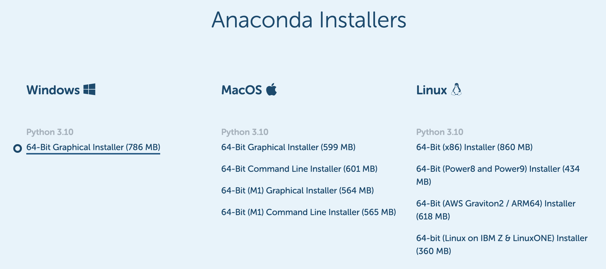

AnacondaによるPython開発環境の構築（補足）
============================================

ここではPythonの数値計算ライブラリ一式と、対話的実行環境であるJupyter-notebookを含むパッケージであるAnacondaのダウンロード・インストール方法について述べる。
PythonやJupyterは現在は京都大学の教育用教PC端末で用いることができるが、
各自のPCにもインストールしておくことを勧める。

本章ではWindowsへのインストール方法を述べるが、OS XやLinux等で用いる場合は
次のページを参考にすること。 https://www.anaconda.com/products/individual

Anacondaのダウンロード
-------------------------

Anacondaは無料かつオープンソース（ソースコードが公開されていること）のソフトウェアであり

https://www.anaconda.com/products/individual

上記ページ下部から自由にダウンロードできる。

Windowsにインストールする場合は、図\ref{fig:Anaconda_download}にあるように、Windows用のものをダウンロードする。
Pythonにはバージョン2系統のものと3系統のものがあるが、
最新のものである3系統のもの（図ではPython3.7）をダウンロードする。
よほどPCが古くないかぎり64bitOSのはずなので，64bitの方を選ぶこと。

Anacondaのダウンロードページの様子。Windows用のPython3.5のものをダウンロードすること。

Anacondaのインストール
-------------------------

先ほどダウンロードしたファイルを実行（クリック）することでインストールが始まる。

ダウンロードしたファイルの保存場所がわからなければインターネットブラウザの設定を確認する。
多くの場合、デフォルトではダウンロードフォルダ（以下の図を参照）にダウンロードされる。

インストーラにはいくつか質問されるが、よくわからなければデフォルトのままでよい。
なお、Windowsのユーザーアカウントにホワイトスペースを含む場合はインストールがうまくいかないかもしれない。
その場合は、途中の選択肢のうち、

+ ユーザーごとのインストール（デフォルト）
+ 全ユーザーに対するインストール（管理者権限が必要）

のうち、「全ユーザーに対するインストール」を行うと回避できる。

（ユーザー名にスペースのほか特殊文字（スラッシュや￥などの記号）を含んだシステムでは、様々なソフトウェアに不具合が生じることがある。今後はできるだけ半角英数字のユーザー名にしておいたほうがよい）

ダウンロードした場所をエクスプローラで開き、ファイルを実行する。

インストーラを実行した時の様子。

インストールには少し時間がかかる。

このような画面が出れば完成である。
